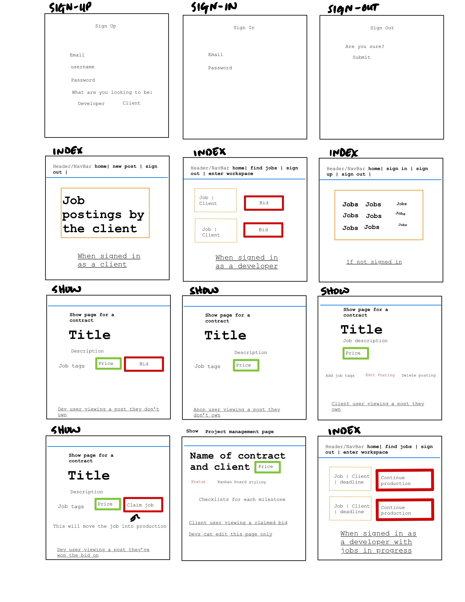

# client-dreamlancer

=======
The goal of Dreamlancer is to provide a one stop shop where clients can request and fulfill their projects with the help of freelance developer(s). Clients will be able to take small peeks as their project is built by their selected development team, a form of transparancy and accountability that is needed in the freelancing world! Developers will be able to update and provide a roadmap as development of a project continues, assuring that no misunderstandings happen along the development process.

## About
This app allows you to create, view, update, and delete technical project postings. You can also create a client or developer/contractor profile to bid or accept bids for projects. Lastly the app allows the developer/contractor to update their progress throughout production to allow the client to track their progress.

## User Stories
* As a user, I want to be able to log into my account
* As a user, I want to be able to log out of my account
* As a client user, I want to be able to create a project/job posting
* As a client user, I want to be able to edit/update a project/job posting
* As a client user, I want to be able to delete a project/job posting
* As a client user, I want to be able to except bids for a project/job posting
* As a client user, I want to be able to view production status
* As a developer user, I want to be able to create an developer account
* As a developer user, I want to be able to update an developer account
* As a developer user, I want to be able to create a profile page
* As a developer user, I want to be able to edit/update a profile page
* As a developer user, I want to be able to delete a profile page
* As a developer user, I want to be able to bid on a project/job
* As a developer user, I want to be able to accept a project/job
* As a developer user, I want to be able to edit/update production status

## Installation Instructions
Fork and clone this repo to run this git file locally. 
Install dependencies with 'npm install'.
Run 'git add' and 'git commit' to save your changes.
Run the development server with 'npm start'

## Wireframes

## Entity Relationship Diagram (ERD)

## Resources

## Collaborator Roles
- Kyle Moreno: Back End
- Lyndonna Munro: Front End 
- Zene Orr: Team Manager
- Efrain Davila: Front End Dev

